# USDCOP Trading System - Architecture Diagrams

**Version:** 2.0.0
**Date:** October 22, 2025

This document contains visual architecture diagrams using Mermaid for the USDCOP Trading System.

---

## System Overview

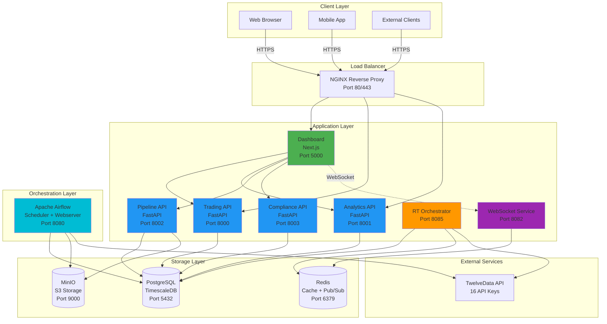

---

## Data Pipeline Flow (L0-L6)

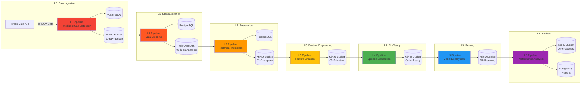

---

## Real-Time Data Flow

```mermaid
sequenceDiagram
    participant Market as 🏦 Market Opens<br/>08:00 AM COT
    participant Airflow as Apache Airflow
    participant L0 as L0 Pipeline
    participant DB as PostgreSQL
    participant RTOrch as RT Orchestrator
    participant Redis as Redis Pub/Sub
    participant WS as WebSocket Service
    participant Client as 💻 Dashboard

    Market->>Airflow: Trigger scheduled DAG
    Airflow->>L0: Execute L0 task
    L0->>DB: Fetch & store OHLCV bar
    L0->>DB: Update pipeline_status table
    L0-->>Airflow: Task complete

    Note over RTOrch: Polling pipeline_status

    RTOrch->>DB: Check L0 completion
    DB-->>RTOrch: L0 completed ✓
    RTOrch->>RTOrch: Start RT collection

    loop Every 5 seconds
        RTOrch->>Market: Fetch current price
        Market-->>RTOrch: Price data
        RTOrch->>DB: Upsert data
        RTOrch->>Redis: PUBLISH market_data
    end

    Redis->>WS: Subscriber receives
    WS->>Client: WebSocket push
    Client->>Client: Update chart
```

---

## WebSocket Architecture

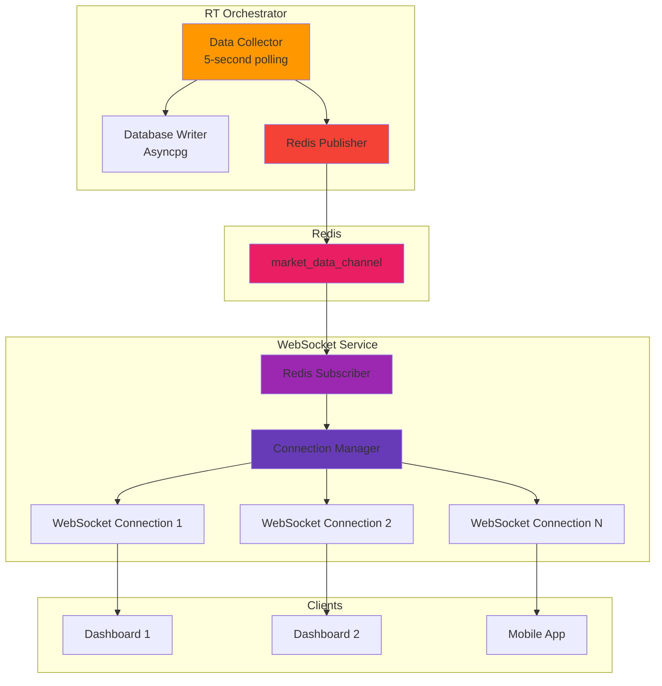

---

## Deployment Architecture

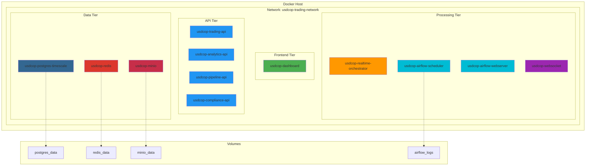

---

## Database Schema (TimescaleDB)

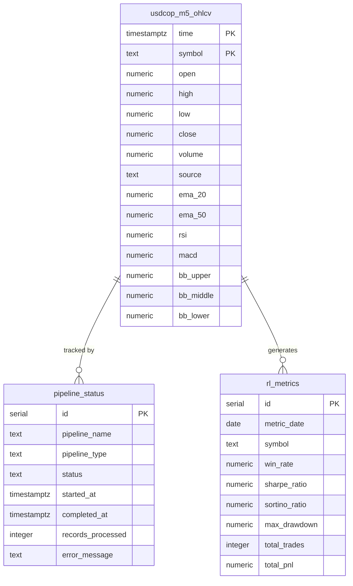

---

## API Request Flow

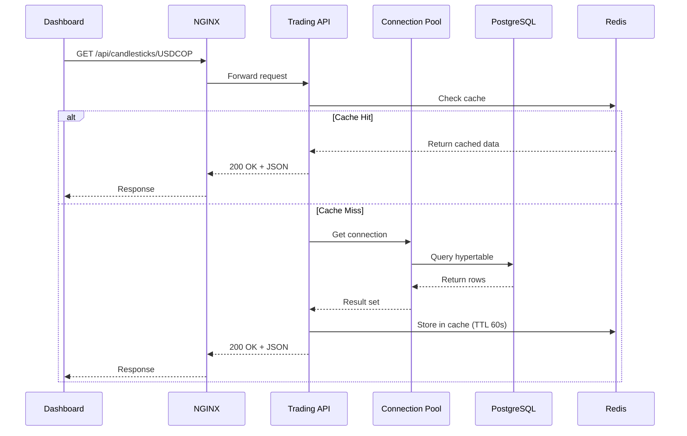

---

## Airflow DAG Dependencies

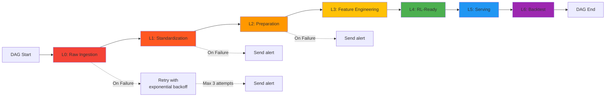

---

## Monitoring & Observability

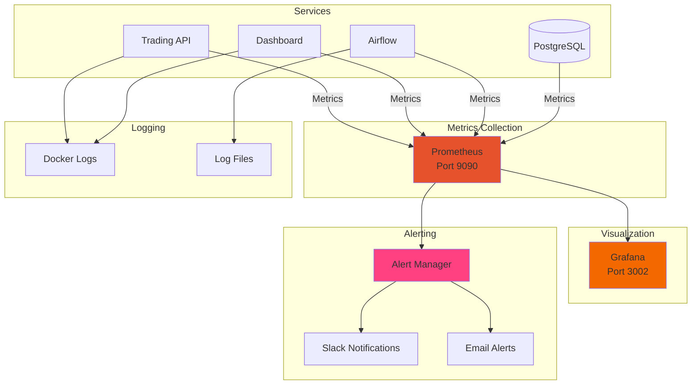

---

## Security Architecture

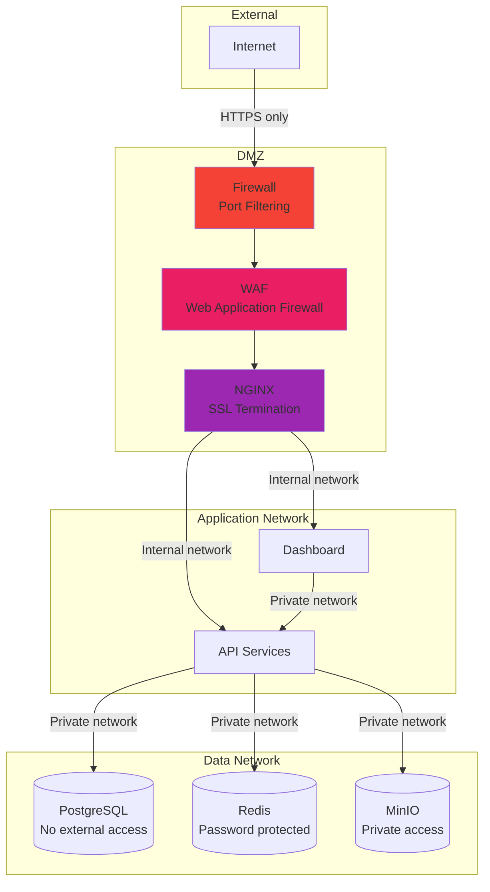

---

## Disaster Recovery Flow

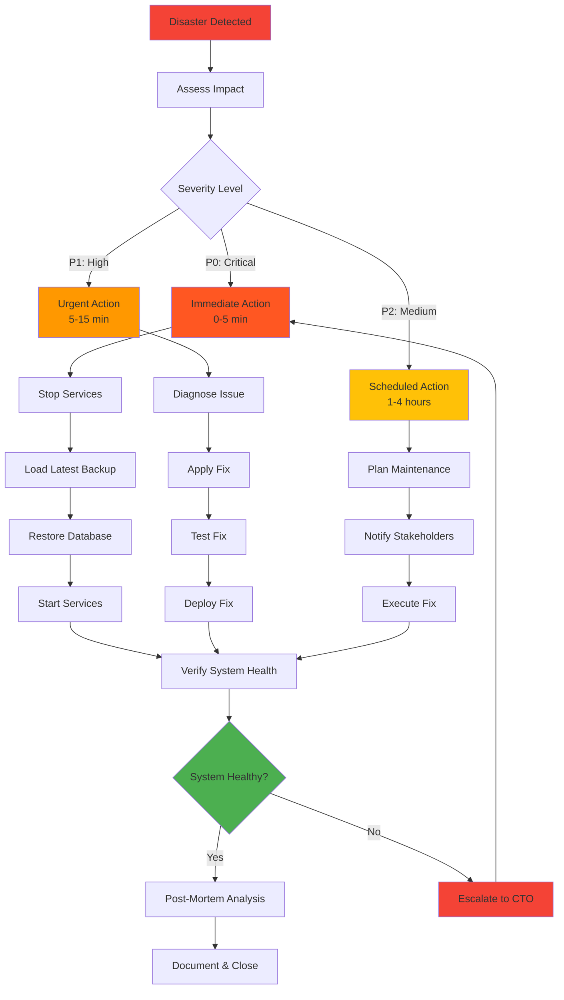

---

## Capacity Planning

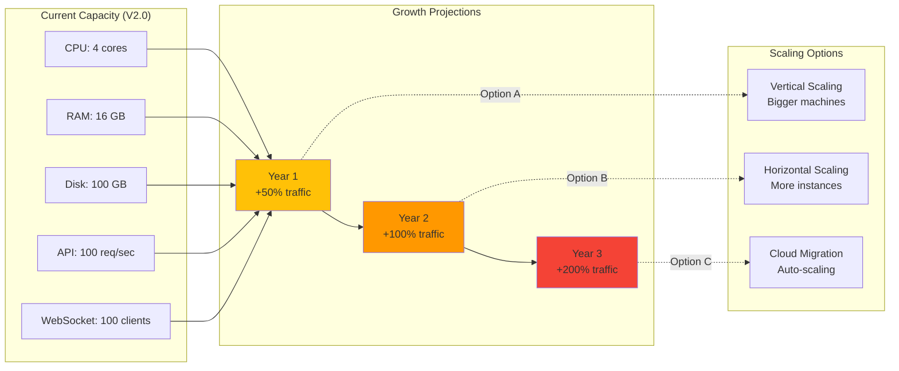

---

## Technology Stack

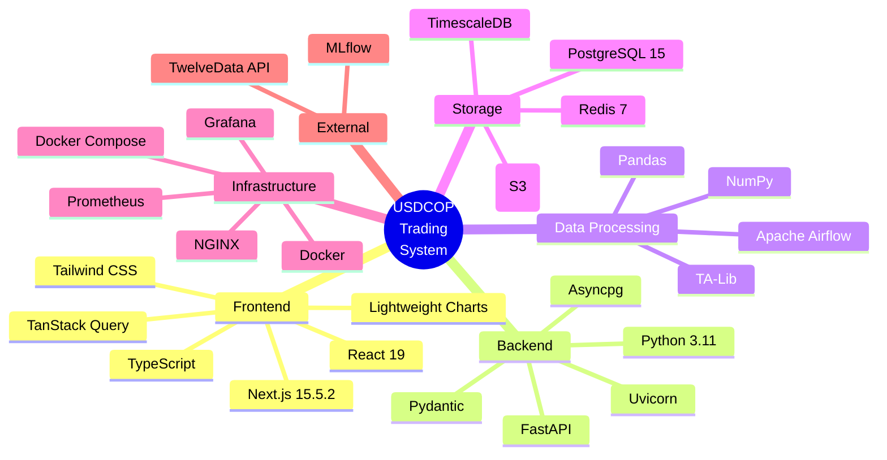

---

## Future Enhancements

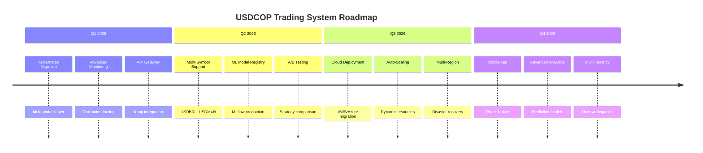

---

**For detailed architecture documentation, see:** `docs/ARCHITECTURE.md`
**For API specifications, see:** `docs/API_REFERENCE_V2.md`
**For operations, see:** `docs/RUNBOOK.md`
