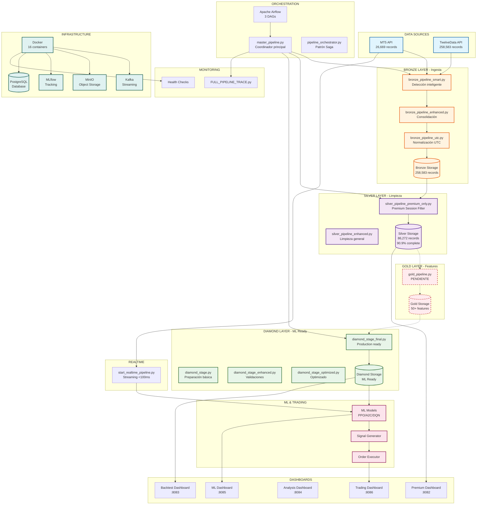
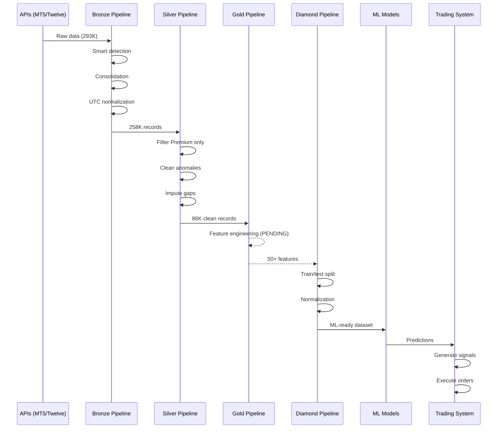

# DIAGRAMA DE ARQUITECTURA DE PIPELINES - USDCOP TRADING
================================================================================

## ARQUITECTURA COMPLETA



## FLUJO DE PROCESAMIENTO DETALLADO



## COMPONENTES POR CAPA

### 🥉 BRONZE (3 pipelines)
```
┌─────────────────────────────────────┐
│  1. bronze_pipeline_smart.py        │ ← Detección inteligente
│  2. bronze_pipeline_enhanced.py     │ ← Consolidación
│  3. bronze_pipeline_utc.py          │ ← Normalización UTC
└─────────────────────────────────────┘
Output: 258,583 registros consolidados
```

### 🥈 SILVER (2 pipelines)
```
┌─────────────────────────────────────┐
│  4. silver_pipeline_enhanced.py     │ ← Limpieza general
│  5. silver_pipeline_premium_only.py │ ← PREMIUM ONLY ⭐
└─────────────────────────────────────┘
Output: 86,272 registros (90.9% completos)
```

### 🥇 GOLD (0 pipelines - PENDIENTE)
```
┌─────────────────────────────────────┐
│  6. gold_pipeline.py                │ ← Por implementar
└─────────────────────────────────────┘
Output esperado: Dataset con 50+ features
```

### 💎 DIAMOND (4 pipelines)
```
┌─────────────────────────────────────┐
│  7. diamond_stage.py                │ ← Básico
│  8. diamond_stage_enhanced.py       │ ← Con validaciones
│  9. diamond_stage_final.py          │ ← Production ready ⭐
│  10. diamond_stage_optimized.py     │ ← Optimizado 3x
└─────────────────────────────────────┘
Output: Dataset ML-ready
```

### 🔄 ORCHESTRATION (3 pipelines)
```
┌─────────────────────────────────────┐
│  11. master_pipeline.py             │ ← Coordinador principal
│  12. pipeline_orchestrator.py       │ ← Patrón Saga
│  13. pipeline.py (usdcop)           │ ← Específico USDCOP
└─────────────────────────────────────┘
```

### 📡 REALTIME (2 pipelines)
```
┌─────────────────────────────────────┐
│  14. start_realtime_pipeline.py     │ ← Streaming <100ms
│  15. FULL_PIPELINE_TRACE.py         │ ← Debugging
└─────────────────────────────────────┘
```

## INFRAESTRUCTURA DOCKER

```yaml
Services (16 containers):
  ├── postgresql (DB)
  ├── redis (Cache)
  ├── minio (S3 Storage)
  ├── kafka (Streaming)
  ├── zookeeper (Kafka coord)
  ├── mlflow (ML tracking)
  ├── airflow-webserver
  ├── airflow-scheduler
  ├── airflow-worker
  ├── airflow-init
  ├── airflow-triggerer
  ├── dashboard-premium (:8082)
  ├── dashboard-backtest (:8083)
  ├── dashboard-analysis (:8084)
  ├── dashboard-ml (:8085)
  └── dashboard-trading (:8086)
```

## CALIDAD POR ETAPA

```
Bronze:  ⭐⭐⭐     (75% completitud, datos crudos)
Silver:  ⭐⭐⭐⭐⭐   (90.9% completitud, Premium only)
Gold:    PENDIENTE  (Feature engineering)
Diamond: ⭐⭐⭐⭐⭐   (100% ML-ready)
```

## DECISIONES CLAVE

1. **Solo Premium Session**: 08:00-14:00 COT por 91.4% completitud
2. **Descarte de London/Afternoon**: <60% completitud inaceptable
3. **Pipeline Smart**: Evita re-descargas innecesarias
4. **Imputación conservadora**: Solo gaps <30 minutos
5. **16 servicios Docker**: Todo accesible vía web

---

*Arquitectura optimizada para calidad de datos y eficiencia de procesamiento*