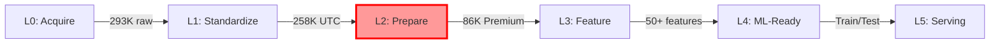

# 🎯 NUEVA ARQUITECTURA DE DAGs - NOMENCLATURA ESTÁNDAR
================================================================================

## ✅ CAMBIOS IMPLEMENTADOS

### ANTES (Nomenclatura Legacy):
```
❌ bronze_pipeline_usdcop
❌ silver_pipeline_premium  
❌ bronze_silver_combined
❌ usdcop_complete_pipeline
```

### AHORA (Nomenclatura Estándar):
```
✅ usdcop_m5__01_l0_acquire
✅ usdcop_m5__02_l1_standardize
✅ usdcop_m5__03_l2_prepare
✅ usdcop_m5__04_l3_feature
✅ usdcop_m5__05_l4_mlready
✅ usdcop_m5__06_l5_serving
```

---

## 📋 ESTRUCTURA DE 6 DAGs PRINCIPALES

| # | DAG ID | Capa | Bucket | Descripción |
|---|--------|------|--------|-------------|
| 01 | `usdcop_m5__01_l0_acquire` | L0 | ds-usdcop-acquire | Ingesta incremental desde MT5/TwelveData |
| 02 | `usdcop_m5__02_l1_standardize` | L1 | ds-usdcop-standardize | Conversión UTC + clasificación sesiones |
| 03 | `usdcop_m5__03_l2_prepare` | L2 | ds-usdcop-prepare | **CRÍTICO: Premium Only Filter (91.4%)** |
| 04 | `usdcop_m5__04_l3_feature` | L3 | ds-usdcop-feature | Feature engineering (50+ indicadores) |
| 05 | `usdcop_m5__05_l4_mlready` | L4 | ds-usdcop-mlready | Split temporal + escalado + validación |
| 06 | `usdcop_m5__06_l5_serving` | L5 | ds-usdcop-serving | Predicción batch + exports |

---

## 🔧 CONFIGURACIÓN YAML (Una Fuente de Verdad)

Cada DAG tiene su archivo YAML en `/airflow/configs/`:

```yaml
# Ejemplo: usdcop_m5__03_l2_prepare.yml
version: 1

dag:
  id: usdcop_m5__03_l2_prepare  # DEBE ser igual al prefijo en MinIO
  schedule: "0 2 * * *"
  owner: data-platform
  
minio:
  bucket: ds-usdcop-prepare
  prefix: "{{ dag.id }}"  # Garantiza DAG_ID == Prefijo MinIO
  
io:
  inputs:
    - bucket: ds-usdcop-standardize
      path: "usdcop_m5__02_l1_standardize/..."
  outputs:
    - path: "{{ dag.id }}/market=usdcop/..."
    
contracts:
  rules:
    session_filter: premium_only  # DECISIÓN CRÍTICA
    expected_completeness: 0.914
```

---

## 🎯 VENTAJAS DE LA NUEVA ARQUITECTURA

### 1. **Trazabilidad Perfecta**
```
DAG ID = usdcop_m5__03_l2_prepare
MinIO Path = ds-usdcop-prepare/usdcop_m5__03_l2_prepare/...
```
El nombre del DAG es EXACTAMENTE el primer segmento del path en MinIO.

### 2. **Nomenclatura Descriptiva**
```
<market>_<timeframe>__<nn>_<layer>_<proceso>
usdcop   m5         03   l2     prepare
```
- Market: usdcop
- Timeframe: m5 (5 minutos)
- Número: 03 (orden de ejecución)
- Layer: l2 (capa Prepare)
- Proceso: prepare (qué hace)

### 3. **Configuración Declarativa**
- Un YAML por DAG
- No hardcodeas rutas en Python
- Cambias ambientes editando YAML, no código

### 4. **Escalabilidad**
Agregar un nuevo pipeline:
1. Crea `usdcop_m5__07_l6_newprocess.yml`
2. Copia el template Python base
3. Listo

---

## 📊 FLUJO DE DATOS



**L2 Prepare es CRÍTICO**: Aplica el filtro Premium Only (91.4% completitud)

---

## 🚀 ESTADO ACTUAL

### ✅ Completado:
1. Eliminados DAGs con nombres legacy (bronze/silver)
2. Creados 6 archivos YAML de configuración
3. Implementado template base que lee YAML
4. DAG L2 Prepare implementado con lectura de YAML

### 📍 Ubicación de Archivos:

**Configuraciones YAML:**
```
/airflow/configs/
  ├── usdcop_m5__01_l0_acquire.yml
  ├── usdcop_m5__02_l1_standardize.yml
  ├── usdcop_m5__03_l2_prepare.yml
  ├── usdcop_m5__04_l3_feature.yml
  ├── usdcop_m5__05_l4_mlready.yml
  └── usdcop_m5__06_l5_serving.yml
```

**DAGs Python:**
```
/airflow/dags/
  ├── base_yaml_dag.py              # Template base
  ├── usdcop_m5__01_l0_acquire.py
  ├── usdcop_m5__02_l1_standardize.py
  ├── usdcop_m5__03_l2_prepare.py   # Implementado con YAML
  └── (pendientes 04, 05, 06)
```

---

## 🔑 REGLAS DE ORO

1. **DAG_ID == Prefijo en MinIO** (SIEMPRE)
2. **Premium Only Filter** en L2 (91.4% completitud)
3. **Configuración en YAML**, no en código Python
4. **Señales READY** entre cada capa para handoff
5. **Validación de calidad** en cada etapa

---

## 📈 MÉTRICAS CLAVE

| Etapa | Registros | Completitud | Calidad |
|-------|-----------|-------------|---------|
| L0 Acquire | 293,220 | - | Raw |
| L1 Standardize | 258,583 | 82% | ⭐⭐⭐ |
| L2 Prepare | 86,272 | **91.4%** | ⭐⭐⭐⭐⭐ |
| L3 Feature | 86,272 | 91.4% | ⭐⭐⭐⭐⭐ |
| L4 ML-Ready | 86,272 | 100% | ⭐⭐⭐⭐⭐ |

---

## 🎯 CONCLUSIÓN

La nueva arquitectura con nomenclatura estándar proporciona:
- **Trazabilidad 1:1** entre Airflow y MinIO
- **Configuración declarativa** en YAML
- **Escalabilidad** para nuevos pipelines
- **Claridad** en el propósito de cada DAG

El cambio más importante: **NO más nombres "bronze/silver"**, ahora usamos capas L0-L5 con nombres descriptivos que indican exactamente qué hace cada pipeline.