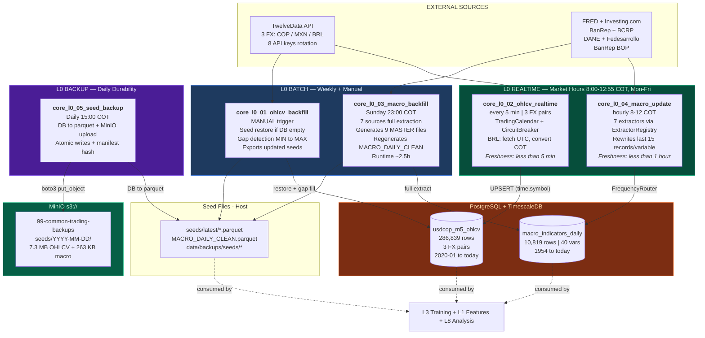

# Slide 1/7 — L0 DATA OPS: Data Foundation

> 5 DAGs | ALL ACTIVE | Shared by every pipeline track
> "Everything starts here: 3 FX pairs every 5 min + 40 macro variables hourly"

## Data Freshness Thresholds

| Data | Max Staleness | Gate Type | Consequence |
|------|---------------|-----------|-------------|
| OHLCV 5-min | 3 days | BLOCKING | Training halted |
| Macro daily | 7 days | BLOCKING | Training halted |
| Model artifacts | 10 days | WARNING | Inference continues |
| News articles | 24 hours | NONE | Analysis lacks context |

## Key Tables

| Table | PK | Update Frequency | Consumers |
|-------|-----|-----------------|-----------|
| `usdcop_m5_ohlcv` | `(time, symbol)` | Every 5 min | L1, L3 H1/H5, L8 |
| `macro_indicators_daily` | `fecha` | Hourly | L3 H1/H5, L8 Analysis |
| `macro_indicators_monthly` | `fecha` | Weekly | L3 (macro features) |
