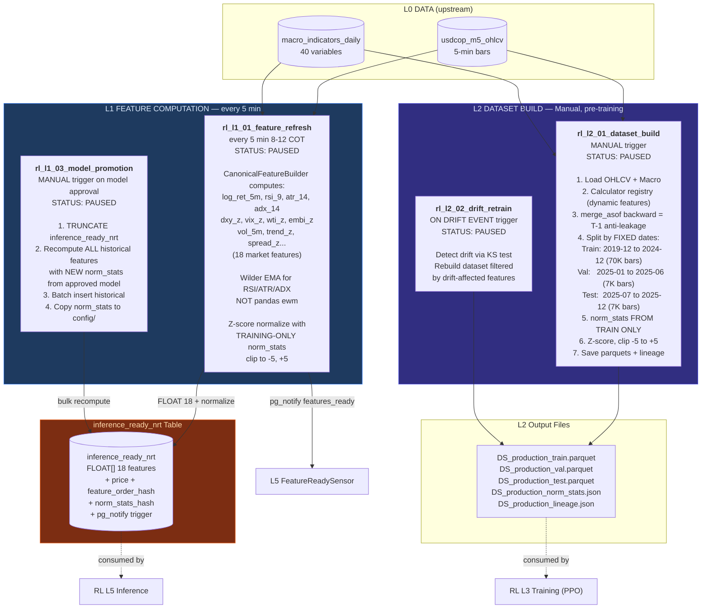

# Slide 2/7 — L1+L2 FEATURE OPS: Feature Engineering & Datasets

> 4 DAGs | ALL PAUSED (RL track only) | H1/H5 load data directly in L3
> "Prepare normalized observations for RL models. Anti-leakage by design."



## Anti-Leakage Mechanisms

| Mechanism | Where | How |
|-----------|-------|-----|
| Train-only norm_stats | L2 step 5 | mean/std computed ONLY on training split |
| Macro T-1 shift | L2 step 3 | `merge_asof(direction='backward')` ensures yesterday's macro |
| Fixed date splits | L2 step 4 | Chronological, no random shuffle, dates from SSOT YAML |
| Feature hash validation | L1 write | SHA256 of FEATURE_ORDER stored alongside features |

## Key Contract: Feature Order

```python
FEATURE_ORDER = (
    'log_ret_5m', 'rsi_9', 'atr_14', 'adx_14',
    'vol_5m', 'trend_z', 'spread_z', 'dxy_z',
    'vix_z', 'wti_z', 'embi_z', 'ust10y_z',
    'ust2y_z', 'ibr_z', 'pct_from_open', 'bar_position',
    'dow_encoded', 'hour_sin'
)
FEATURE_ORDER_HASH = SHA256(FEATURE_ORDER)[:16]
```

> If hash mismatches between L1 and L5 at inference time, predictions are garbage.

## Why H1/H5 Skip L1+L2

H1 and H5 forecasting tracks load data DIRECTLY in their L3 DAGs from seed parquets.
They do NOT use `inference_ready_nrt` or the L2 dataset builder.
L1+L2 exist ONLY for the RL track (PPO on 5-min bars, deprioritized).
