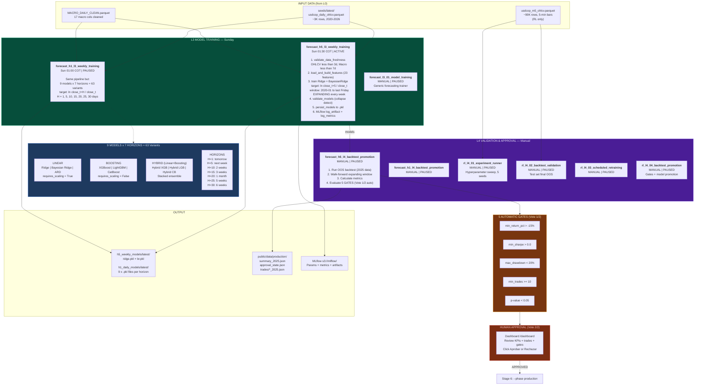

# Slide 3/7 — L3+L4 TRAINING OPS: Model Training & Validation

> 8 DAGs | 1 ACTIVE (H5-L3) + 7 PAUSED | 9 models x 7 horizons = 63 variants
> "Sunday: retrain everything. L4: backtest OOS + 5 automatic gates + human approval."



## Walk-Forward Validation (How 63 Variants are Tested)

```
For each model x horizon combination:

    EXPANDING WINDOW (grows each iteration):
    ┌────────────────────────────────────────────────────────────┐
    │ iter 1: Train [2020───2023]  Predict [2023-W01]  actual?  │
    │ iter 2: Train [2020────2023+1w]  Predict [next]  actual?  │
    │ iter 3: Train [2020─────2023+2w]  Predict [next]  actual? │
    │ ...                                                        │
    │ iter N: Train [2020──────────2025]  Predict [last] actual? │
    └────────────────────────────────────────────────────────────┘
    
    Metrics from all iterations:
    DA (Direction Accuracy), RMSE, MAE, R2,
    Sharpe, Profit Factor, MaxDD, Total Return
    
    THEN train FINAL model on ALL data → predict FUTURE
```

## The 63 Variants Matrix

| Model | H=1 | H=5 | H=10 | H=15 | H=20 | H=25 | H=30 |
|-------|-----|-----|------|------|------|------|------|
| Ridge | DA% | DA% | DA% | DA% | DA% | DA% | DA% |
| Bayesian Ridge | DA% | DA% | DA% | DA% | DA% | DA% | DA% |
| ARD | DA% | DA% | DA% | DA% | DA% | DA% | DA% |
| XGBoost | DA% | DA% | DA% | DA% | DA% | DA% | DA% |
| LightGBM | DA% | DA% | DA% | DA% | DA% | DA% | DA% |
| CatBoost | DA% | DA% | DA% | DA% | DA% | DA% | DA% |
| Hybrid XGB | DA% | DA% | DA% | DA% | DA% | DA% | DA% |
| Hybrid LGB | DA% | DA% | DA% | DA% | DA% | DA% | DA% |
| Hybrid CB | DA% | DA% | DA% | DA% | DA% | DA% | DA% |

> 63 backtest rows + 63 forward_forecast rows = 126 rows per week in CSV.
> Only Ridge + BR at H=5 go to PRODUCTION (Smart Simple v2.0).
> The other 61 variants feed the /forecasting DASHBOARD for model comparison.

## RL Experiment Protocol (L4)

| Rule | Enforcement |
|------|-------------|
| ONE variable per experiment | Never change action space + model + features simultaneously |
| 5 seeds minimum | [42, 123, 456, 789, 1337], no exceptions |
| Statistical validation | p < 0.05, DA > 55%, Sharpe > 1.0, CI excludes zero |
| Compare vs baselines | Buy-and-hold (-12.29%), random agent (-4.12%) |
| Frozen SSOT config | Each experiment = complete pipeline_ssot.yaml |
