# Slide 4/7 — L5+L7 SIGNAL & EXECUTION: Decide and Act

> 6 DAGs | 3 ACTIVE (H5 production) + 3 PAUSED | The money-making layer
> "Monday: generate signal + regime gate. Mon-Fri: monitor TP/HS. Friday: close."

```mermaid
flowchart TB
    subgraph L3OUT["FROM L3 (Sunday training)"]
        MODELS["Ridge.pkl + BR.pkl<br/>h5_weekly_models/latest/"]
        FEATURES["21 features from<br/>daily OHLCV + macro"]
    end

    subgraph L5_SIGNAL["L5 SIGNAL GENERATION — Monday 08:15 COT"]
        SIG["<b>forecast_h5_l5_weekly_signal</b><br/>Mon 08:15 COT | ACTIVE<br/><br/>ExternalTaskSensor waits for H5-L3<br/><br/>1. Load Ridge + BR models<br/>2. Each predicts ln(close_t+5 / close_t)<br/>3. Ensemble = mean(ridge, br)<br/>4. Direction: pos=LONG, neg=SHORT<br/>5. Confidence scoring 3-tier:<br/>   HIGH: tight agreement + high magnitude<br/>   MEDIUM: loose agreement or medium mag<br/>   LOW: neither"]
    end

    subgraph L5_VOL["L5 VOL-TARGETING + REGIME GATE — Monday 08:45 COT"]
        VOL["<b>forecast_h5_l5_vol_targeting</b><br/>Mon 08:45 COT | ACTIVE<br/><br/>1. Realized vol (21d lookback)<br/>2. Base leverage = target_vol 15% / real_vol<br/>3. Asymmetric sizing + confidence mult<br/><br/>4. REGIME GATE (Hurst R/S, 60d):<br/>   TRENDING H>0.52: sizing x1.0 FULL<br/>   INDETERMINATE 0.42-0.52: sizing x0.40<br/>   MEAN-REVERTING H<0.42: SKIP TRADE<br/><br/>5. DYNAMIC LEVERAGE:<br/>   Scale by rolling_WR x drawdown 0.25-1.0<br/><br/>6. EFFECTIVE HS:<br/>   hard_stop = min(HS_base, 3.5%/leverage)<br/><br/>7. Adaptive stops:<br/>   HS = clamp(vol_weekly x 2.0, 1%, 3%)<br/>   TP = HS x 0.5"]
    end

    subgraph SIGNAL_OUT["SIGNAL OUTPUT"]
        SIG_TBL[("forecast_h5_signals<br/><br/>direction: SHORT<br/>confidence: HIGH<br/>leverage: 1.5x<br/>hard_stop: 2.81%<br/>take_profit: 1.41%<br/>regime: indeterminate<br/>hurst: 0.47<br/>skip_trade: false")]
    end

    subgraph L7["L7 EXECUTION — Mon-Fri */30 9:00-13:00 COT"]
        direction TB
        EXEC["<b>forecast_h5_l7_multiday_executor</b><br/>Mon-Fri every 30 min | ACTIVE<br/><br/>MONDAY 09:00 ENTRY:<br/>  Read signal from DB<br/>  If skip_trade=True: NO TRADE<br/>  Place limit entry (0% maker fee)<br/><br/>MON-FRI MONITOR every 30 min:<br/>  SHORT: TP hit if bar_low <= entry x (1-TP%)<br/>  SHORT: HS hit if bar_high >= entry x (1+HS%)<br/>  No trailing stop, no re-entry<br/><br/>FRIDAY 12:50 CLOSE:<br/>  Market order, exit_reason=week_end"]
    end

    subgraph L7_OUT["EXECUTION OUTPUT"]
        EXEC_TBL[("forecast_h5_executions<br/>+ forecast_h5_subtrades<br/><br/>entry_price, exit_price<br/>pnl_pct, exit_reason<br/>confidence_tier, leverage")]
    end

    subgraph PAUSED_L5["L5+L7 PAUSED TRACKS"]
        H1_INF["forecast_h1_l5_daily_inference<br/>13:00 COT | PAUSED"]
        H1_VOL["forecast_h1_l5_vol_targeting<br/>13:30 COT | PAUSED"]
        H1_EXEC["forecast_h1_l7_smart_executor<br/>Trailing stop | PAUSED"]
        RL_INF["rl_l5_01_production_inference<br/>every 5 min | PAUSED"]
    end

    MODELS --> SIG
    FEATURES --> SIG
    SIG -->|"signal + confidence"| L5_VOL
    L5_VOL --> SIG_TBL
    SIG_TBL -->|"read signal"| EXEC
    EXEC --> L7_OUT

    L7_OUT -.->|"consumed by"| L6["L6 Weekly Monitor (Fri 14:30)"]

    style L5_SIGNAL fill:#064e3b,stroke:#10b981,color:#d1fae5
    style L5_VOL fill:#78350f,stroke:#f59e0b,color:#fef3c7
    style L7 fill:#7c2d12,stroke:#ef4444,color:#fecaca
    style PAUSED_L5 fill:#374151,stroke:#6b7280,color:#9ca3af
```



## Trade Lifecycle Example

```
Monday 08:15   L5 Signal: SHORT, ensemble_return=-0.85%, confidence=HIGH
Monday 08:45   L5 Vol-Target: regime=indeterminate, Hurst=0.47
               leverage=1.5x, HS=2.81%, TP=1.41%, skip_trade=false
Monday 09:00   L7 Entry: limit order at $4,380.50
Monday 09:30   L7 Monitor: high=4382, low=4375 -- no hit
Monday 10:00   L7 Monitor: low=4318 -- TP HIT! (4380 x 0.9859 = 4318.7)
               Close at $4,318, PnL = +1.43%, exit_reason=take_profit
               ─── OR if no TP/HS hit ───
Friday 12:50   L7 Close: market order at $4,365, exit_reason=week_end
```

## Regime Gate Impact (2026 YTD)

| Metric | Without Gate (v1.1.0) | With Gate (v2.0) |
|--------|----------------------|------------------|
| Return | -5.17% | +0.61% |
| Trades | 6 (4 losses) | 1 (0 losses) |
| Weeks blocked | 0 | 13 of 14 (mean-reverting) |
| $10K becomes | $9,483 | $10,061 |

> The regime gate is the MVP. It correctly identified Q1 2026 as mean-reverting
> (Hurst 0.16-0.44) and BLOCKED trading, preventing ~$570 in losses.

## Sizing Rules

| Direction | Confidence | Leverage | Action |
|-----------|-----------|----------|--------|
| SHORT | HIGH | 1.5x | TRADE |
| SHORT | MEDIUM | 1.5x | TRADE |
| SHORT | LOW | 1.5x | TRADE |
| LONG | HIGH | 1.0x | TRADE |
| LONG | MEDIUM | 0.5x | TRADE |
| LONG | LOW | 0.0x | SKIP (net effect = -0.75%) |
