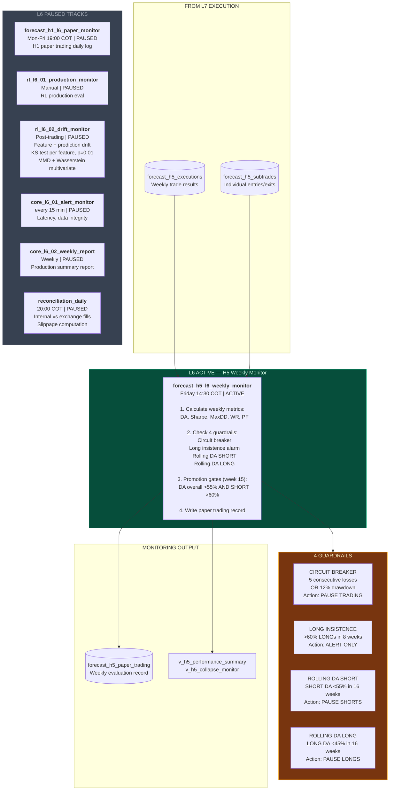

# Slide 5/7 — L6 MONITORING OPS: Evaluate and Protect

> 7 DAGs | 1 ACTIVE (H5 monitor) + 6 PAUSED | Guardrails, drift, reconciliation
> "Friday: was this week profitable? Are guardrails triggered? Should we keep trading?"



## Risk Management Architecture (3 Layers)

```
Signal arrives
    |
    v
LAYER 1: Chain of Responsibility (9 checks in order)
    0. HOLD signal      --> short-circuit, no trade
    10. Trading hours   --> 8:00-16:00 COT Mon-Fri
    20. Circuit breaker --> CB active? block all
    30. Cooldown        --> cooldown expired?
    40. Confidence      --> min 0.6
    50. Daily loss      --> -2% daily? trigger CB
    55. Drawdown        --> -1% max? trigger kill switch
    60. Consecutive     --> 3+ losses? activate cooldown 300s
    70. Max trades      --> 10/day limit
    |
    v APPROVED
LAYER 2: Risk Enforcer (7 pluggable rules)
    1. Kill switch      --> BLOCK (drawdown >= 15%)
    2. Daily loss       --> BLOCK (P&L <= -5%)
    3. Trade limit      --> BLOCK (>= 20/day)
    4. Cooldown         --> BLOCK (period active)
    5. Short permission --> BLOCK (if shorts disabled)
    6. Position size    --> REDUCE (cap at max)
    7. Confidence       --> BLOCK (below threshold)
    |
    v ALLOW / REDUCE / BLOCK
LAYER 3: Kill Switch (highest priority)
    Active? ALL trades blocked
    Only exit signals (CLOSE, FLAT) pass through
    Reset requires confirm=True + audit trail
```

## Promotion Gates (Week 15)

| Gate | Pass | Fail |
|------|------|------|
| DA overall > 55% AND SHORT > 60% | Promote to live | Check keep conditions |
| DA overall < 50% | -- | Discard strategy |
| SHORT DA > 60% but LONG DA < 45% | -- | Switch to SHORT-only |
