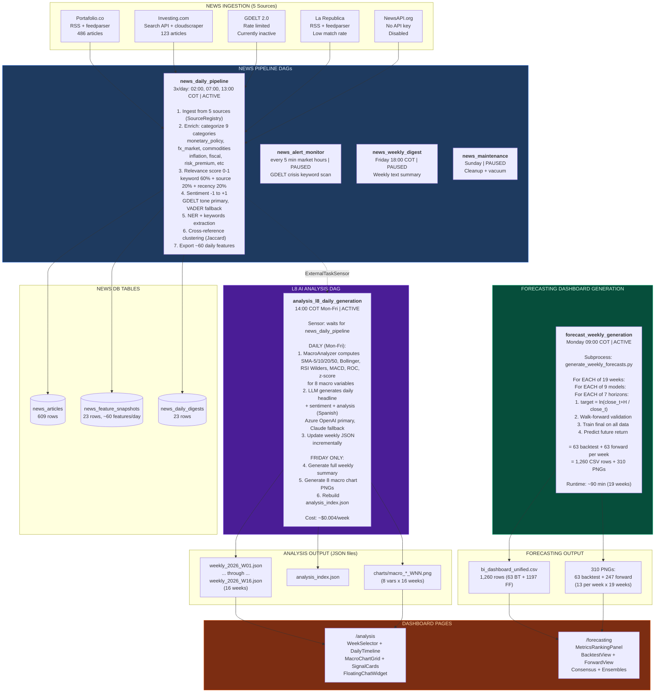

# Slide 6/7 — INTELLIGENCE: News + AI Analysis + Dashboard Generation

> 6 DAGs | 3 ACTIVE + 3 PAUSED | 5 news sources, LLM analysis, 9x7 forecasting output
> "What does the market say? Generate daily intelligence + populate dashboard pages."



## Forward Forecast PNG Anatomy

```
Each model PNG shows predicted USDCOP price at 7 future dates:

Price ($)
  4,400 |
        |        .--- H=10: $4,328
  4,350 |   .----'
        |  /         .--- H=20: $4,290
  4,300 |/----------'
        |    '--- H=5: $4,343     '--- H=30: $4,265
  4,250 |
        +----+----+----+----+----+----+----+---
         Today H=1 H=5 H=10 H=15 H=20 H=25 H=30
              1d   1w   2w   3w   1m   5w   6w

  pred_price[H] = base_price x exp(model.predict(features))
```

## 13 PNGs Per Week

| # | PNG | Content |
|---|-----|---------|
| 1-9 | `forward_{model}_{week}.png` | Price curve for each of 9 models |
| 10 | `forward_consensus_{week}.png` | Average of all 9 models |
| 11 | `forward_ensemble_top_3_{week}.png` | Top 3 by direction accuracy |
| 12 | `forward_ensemble_best_of_breed_{week}.png` | Best linear + best boosting + best hybrid |
| 13 | `forward_ensemble_top_6_mean_{week}.png` | Top 6 averaged |

## LLM Configuration

| Setting | Value |
|---------|-------|
| Primary | Azure OpenAI GPT-4o-mini |
| Fallback | Anthropic Claude Sonnet |
| Language | Spanish |
| Cache | File-based, TTL 24h |
| Budget | $1/day, $15/month |
| Actual cost | ~$0.004/week |
