# Slide 7/7 — SYSTEM OPS: Watchdog & Orchestration

> 3 DAGs | 1 ACTIVE (watchdog) + 2 PAUSED | Auto-heal, MinIO validation, drift
> "Who watches the watchers? The watchdog runs hourly, detects issues, and fixes them."

```mermaid
flowchart TB
    subgraph WD["CORE WATCHDOG — Hourly 8-13 COT Mon-Fri"]
        direction TB
        WATCHDOG["<b>core_watchdog</b><br/>Hourly 8:00-13:00 COT | ACTIVE<br/><br/>8 HEALTH CHECKS + AUTO-HEAL"]
    end

    subgraph CHECKS["8 HEALTH CHECKS"]
        direction TB
        C1["1. check_ohlcv<br/>usdcop_m5_ohlcv MAX(time)<br/>Stale if > 15 min during market"]
        C2["2. check_macro<br/>macro_indicators_daily MAX(fecha)<br/>Stale if > 2 days"]
        C3["3. check_forecasting<br/>bi_dashboard_unified.csv<br/>latest week < current week?"]
        C4["4. check_analysis<br/>weekly_YYYY_WNN.json<br/>Current week file exists?"]
        C5["5. check_h5_signal<br/>forecast_h5_signals<br/>Monday only: signal for this week?"]
        C6["6. check_news<br/>news_articles MAX(published_at)<br/>Stale if > 24h"]
        C7["7. check_backups<br/>backup_manifest.json mtime<br/>Stale if > 48h"]
        C8["8. check_minio<br/>3 buckets exist?<br/>seeds/ objects age < 48h?"]
    end

    subgraph HEAL["AUTO-HEAL ACTIONS"]
        direction TB
        A1["trigger core_l0_02_ohlcv_realtime"]
        A2["trigger core_l0_04_macro_update"]
        A3["subprocess: generate_weekly_forecasts.py"]
        A4["subprocess: generate_weekly_analysis.py"]
        A5["trigger forecast_h5_l5_weekly_signal"]
        A6["trigger news_daily_pipeline"]
        A7["trigger core_l0_05_seed_backup"]
        A8["trigger core_l0_01_ohlcv_backfill"]
    end

    subgraph REPORT["WATCHDOG REPORT"]
        RPT["WATCHDOG REPORT 2026-04-16T14:06 COT<br/><br/>OK ohlcv: skip (outside market)<br/>OK macro: ok<br/>OK forecasting: ok<br/>OK analysis: ok<br/>OK h5_signal: skip (not Monday)<br/>OK news: ok<br/>FAIL backups: stale<br/>OK minio: ok (3 buckets, 3 objects)<br/><br/>ACTIONS TAKEN: 1<br/>Triggered OHLCV backfill"]
    end

    subgraph PAUSED_SYS["PAUSED SYSTEM DAGs"]
        RECON["<b>reconciliation_daily</b><br/>20:00 COT | PAUSED<br/>Compare internal vs exchange<br/>Compute slippage"]
        ALERT["<b>core_l6_01_alert_monitor</b><br/>every 15 min | PAUSED<br/>Latency + data integrity"]
        WKRPT["<b>core_l6_02_weekly_report</b><br/>Weekly | PAUSED<br/>Production summary"]
    end

    subgraph INFRA["INFRASTRUCTURE STATUS"]
        direction TB
        PG["PostgreSQL+TimescaleDB<br/>Port 5432 | HEALTHY"]
        RD["Redis<br/>Port 6379 | HEALTHY"]
        MN["MinIO<br/>Port 9001 | HEALTHY<br/>13 buckets, 7.4 MB seeds"]
        ML["MLflow<br/>Port 5001 | HEALTHY<br/>2 experiments, 1 run"]
        AF["Airflow<br/>Port 8080 | HEALTHY<br/>39 DAGs, 14 active"]
        SB["SignalBridge<br/>Port 8085 | HEALTHY<br/>Paper trading mode"]
        DS["Dashboard Next.js<br/>Port 5000 | HEALTHY<br/>8 pages"]
    end

    WATCHDOG --> CHECKS
    C1 -->|"stale"| A1 & A8
    C2 -->|"stale"| A2
    C3 -->|"stale"| A3
    C4 -->|"missing"| A4
    C5 -->|"missing Mon"| A5
    C6 -->|"stale"| A6
    C7 -->|"stale"| A7
    CHECKS --> REPORT

    style WD fill:#064e3b,stroke:#10b981,color:#d1fae5
    style CHECKS fill:#1e3a5f,stroke:#3b82f6,color:#dbeafe
    style HEAL fill:#78350f,stroke:#f59e0b,color:#fef3c7
    style REPORT fill:#312e81,stroke:#6366f1,color:#e0e7ff
    style PAUSED_SYS fill:#374151,stroke:#6b7280,color:#9ca3af
    style INFRA fill:#065f46,stroke:#34d399,color:#d1fae5
```



## Complete Weekly Schedule (COT Timezone)

```
SUNDAY (Maintenance + Training)
  23:00  L0: macro_backfill (7 sources, ~2.5h)
  01:00  L3: H1 training - 9 models x 7 horizons (PAUSED)
  01:30  L3: H5 training - Ridge+BR, MLflow logged (ACTIVE)

MONDAY
  08:00  L0: OHLCV realtime starts (every 5 min)
  08:00  L0: Macro update starts (hourly)
  08:00  Watchdog: hourly checks begin
  08:15  L5: H5 signal (ensemble + confidence)
  08:45  L5: H5 vol-targeting (regime gate + stops)
  09:00  L7: H5 entry order placed
  09:00  L8: forecast_weekly_generation (CSV + 76 PNGs, ~18 min)
  09:00-13:00  L7: monitor TP/HS every 30 min

TUESDAY - THURSDAY
  08:00-13:00  L0: OHLCV + macro flowing
  08:00-13:00  Watchdog: hourly auto-heal
  09:00-13:00  L7: monitor TP/HS every 30 min
  02:00, 07:00, 13:00  News: 3x daily ingestion
  14:00  L8: daily analysis (LLM + macro)

FRIDAY
  09:00-12:50  L7: final monitoring window
  12:50  L7: CLOSE remaining position (week_end)
  14:00  L8: daily + FULL WEEKLY summary + charts
  14:30  L6: weekly monitor (metrics + guardrails)
  15:00  L0: seed backup (parquets + MinIO)
```

## Infrastructure Health Matrix

| Service | Port | Status | Integration |
|---------|------|--------|-------------|
| PostgreSQL+TimescaleDB | 5432 | HEALTHY | All DAGs read/write |
| Redis | 6379 | HEALTHY | Airflow broker, caching |
| MinIO | 9001 | HEALTHY | Seed backups, MLflow artifacts |
| MLflow | 5001 | HEALTHY | L3 training logs params+metrics+artifacts |
| Airflow | 8080 | HEALTHY | 39 DAGs orchestrated |
| SignalBridge | 8085 | HEALTHY | Paper trading OMS |
| Dashboard | 5000 | HEALTHY | 8 pages, real-time data |
| Trading API | 8000 | HEALTHY | Market data WebSocket |
| Analytics API | 8001 | HEALTHY | Trading analytics |
| Backtest API | 8003 | HEALTHY | Replay engine |
| pgAdmin | 5050 | HEALTHY | DB management |

## 39 DAGs Summary

| Track | Active | Paused | Total |
|-------|--------|--------|-------|
| L0 Data | 5 | 0 | 5 |
| L1+L2 Feature (RL) | 0 | 4 | 4 |
| L3+L4 Training | 1 | 7 | 8 |
| L5+L7 Signal+Exec | 3 | 3 | 6 |
| L6 Monitoring | 1 | 6 | 7 |
| News+Analysis+Dashboard | 3 | 3 | 6 |
| System Watchdog | 1 | 2 | 3 |
| **TOTAL** | **14** | **25** | **39** |
